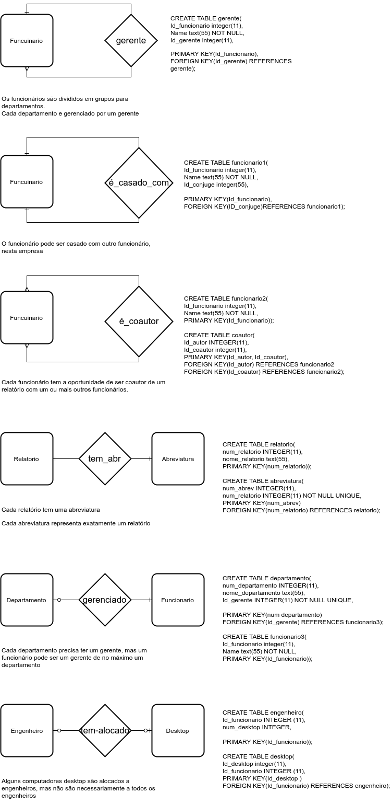

# Lista de transposição

## Em um relacionamento binário `1:1`  

- quando duas entidades são **obrigatórias** cada entidade se torna uma tabela, e a `PK` de qualquer entidade pode aparecer na tabela da outra entidade como `FK`.
- quando, em uma das entidades, o relacionamento é **opcional** deve conter a `FK` da outra entidade em sua tabela transforma
da.
- quando as duas entidades são **opcionais** qualquer entidade pode conter a `FK` embutida da outra entidade, com `null` permitido na `FK`.
 
## Em relacionamento binário `1:m`

- esse tipo de relacionamento poderá ser **opcional** ou **obrigatório** no lado `m`, sem afetar a tranformação.
- no lado `1` ele pode ser **obrigatório** ou **opcional**.
- em todos os casos a `fk` deverá ficar no lado `m`, que representa a entidade filha
- com `null` permitido para `fk` nos casos em que no lado `1` for opcional.

## Em relacionamentos binário `m:n`

- em sendo **opcional** para as duas entidades uma nova tabela será criada com a `pk` de cada entidade;
- a mesma regra para os casos onde o condição for **obrigatório**;
- a cláusula `not null` deverá aparecer para as `fk's` nos dois casos, a cima;
- sem afetar as definições de `null` ou `not null`, a tebela `SQL` derivada de uma entidade **opcional** pode ter `0` linhas.

## Relacionamento ternário e n-ário

- n-ários possuem `n + 1` variações possíveis de conectividade;
- existem `4` variações possíveis em um relacionamento **ternário**;
- todas as variações são transpostas para uma tabela `SQL` que deve conter as `pk’s` de todas as entidades;
- as regras de restrição para a `fk` sobre `update` e `delete` para relacionamento ternários transformados em tabelas `SQL` sempre precisam ser propagadas, pois cada valor da tabela depende da existência  da `pk` referenciada;

### quando cada relacionamento tem cardinalidade `1` a tabela **resultante** tem:

- `3` `pk’s` distintas possíveis; - são `3` as dependências funcionais
- `Df’s`; - não existe restrição de **opcionalidade**
- o `n.º` relacionamentos define o limite inferior sobre o `n.º` de `DF’s`;
- define-se `unique` com o grau `1` para cada par de a entidades na definição da `pk` da entidade resultante;
    
### quando cada relacionamento tem cardinalidade `1:1:m` a tabela **resultante** tem:

- `2` `pk’s` distintas possíveis entre `1` e `n`;
- são `2` as dependências funcionais - `Df’s`;
- define-se `unique` com o grau `n` e o grau `1` com a entidade que não teve a `pk` utilizada na definição da `pk` da entidade resultante;
    
### quando cada relacionamento tem cardinalidade `1:m:n` a tabela **resultante** tem:

- `2` `pk’s` distintas possíveis entre `m` e `n`;
- é `1` a dependência funcional - `Df`;
    
### quando cada relacionamento tem cardinalidade `m:m:n` a tabela **resultante** tem: 

-`uma` única `pk` composta, sem considerar os atributos próprios do relacionamento;
- é `0` a dependência funcional - `Df`;
 
---

